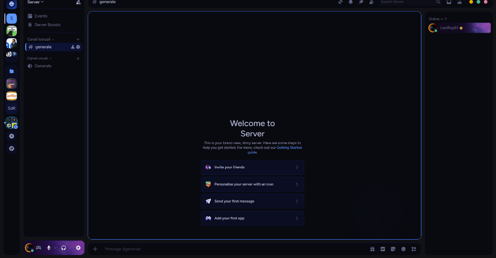

# Midnight Inter Milan Theme 🔵⚫⭐



A premium, modern dark Discord theme customized for **FC Internazionale Milano (Inter Milan)**. Based on the elegant [Midnight Theme](https://github.com/refact0r/midnight-discord) by refact0r.

## Features

- **Nerazzurri Identity**: Fully themed with Inter's signature deep dark blue-black (`#02040a`) backgrounds, electric blue highlights, and brand gold accents.
- **Full-Color Inter Logo**: Direct Messages / Home button replaced with the official, full-color Inter 2021 monogram SVG with a 360-degree rotation animation on hover.
- **San Siro Stadium Backdrop**: Translucent glassmorphism panels showing a beautiful view of Stadio Giuseppe Meazza (San Siro) at night.
- **Glowing Scrollbars**: Inter Blue scrollbars that glow and change to Inter Gold when hovered.
- **Subtle Watermark**: A high-class, semi-transparent Inter Milan monogram watermark in the chat background area.
- **Custom Badges**: Gold-colored mention badges and electric blue unread notifications.

---

## How to Install on Vencord

### Method 1: Online Theme Link (Recommended)
1. In Discord, open **User Settings** (gear icon) -> **Themes** (under the Vencord section).
2. Paste the following URL in the **Online Themes** text box:
   ```
   https://raw.githubusercontent.com/LeoRoy61/midnight-inter-theme-for-vencord/main/midnight-inter.theme.css
   ```
3. Il tema verrà caricato e applicato automaticamente!

### Method 2: Quick CSS
1. Copy the entire contents of [midnight-inter.theme.css](midnight-inter.theme.css).
2. Go to **User Settings** -> **Quick CSS** (under the Vencord section).
3. Paste the code there and save.

---

## BetterDiscord Installation
1. Download the `midnight-inter.theme.css` file from this repository.
2. Go to Discord **User Settings** -> **Themes** (under BetterDiscord).
3. Click **Open Themes Folder**.
4. Drag and drop the downloaded `.theme.css` file into that folder.
5. Enable **Midnight Inter Milan** in Discord.
